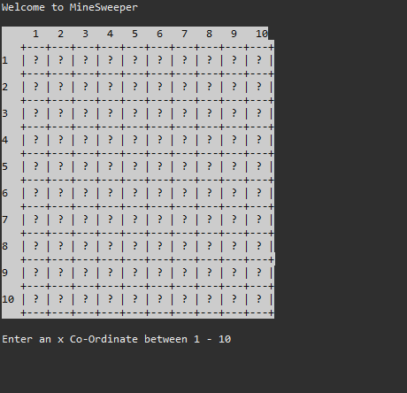
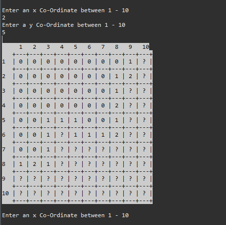
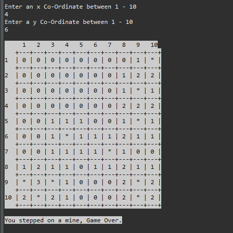

# MineSweeper

This is a recreations of the Minesweeper game in the Java console.

# Table of Contents

- [Features](#features)
- [Tech Stack](#tech-stack)
- [Requirements](#requirements)
  - [MVP](#mvp)
  - [Bonus](#bonus)
- [Known Issues](#known-issuses)
- [Future Goals](#future-goals)

## Features

- Upon beginning the game you will be prompted to enter a x-axis coordinate and a y-axis coordinate.

  

- After entering the first coordinate your mine field will look something like the picture below, if you have selected a zero it will open up a section of the field leaving only numbers on the edges.

  

- If the coordinate entered is a mine then the game will end you will be shown the mine field so you can see where you went wrong.

  

## Tech Stack

- Java

## Requirements

### MVP

- Recreate a simplified version of the game Minesweeper to be played in the java console.
- The game should be able to randomly generate 10 mines in a 10x10 grid.
- The user will be able to enter a command that represents a coordinate to check a location for a mine.
- The application will display a number from 0-8 depending on how many mines surround that location.
- If the user selects a mine, the game will respond "boom!" and the game will be lost If every non-mine square has been revealed, the game is won Render the grid to the console after every user command.

### Bonus

- Allow for the user to configure number of mines and grid size via a configuration.json file (Difficult).
- Discovering an empty square should reveal all squares around it, and cascade into other nearby empty squares.

## Known Issues

- I have not yet configured the second part of the bonus allowing a user to choose the difficulty they would like to play

## Future Goals

- Add difficulty selection.
- Ask the user if they would like to play again before ending the game process.
- Add some more color to give each number some contrast making it easier to read.
